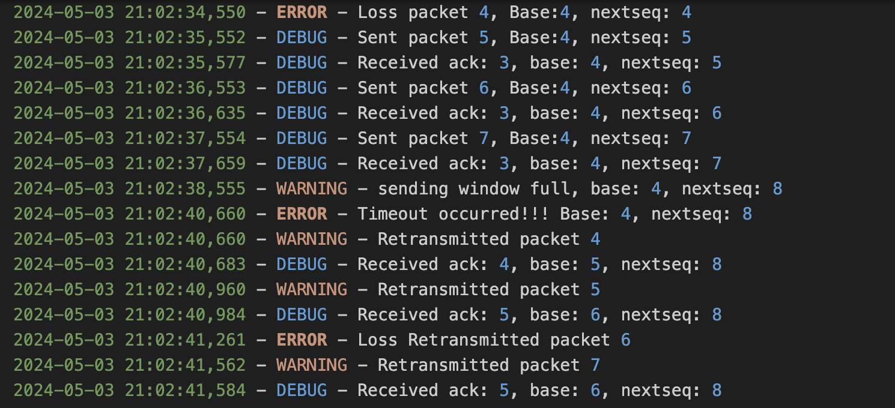

# ReliableUDP
An assignment of XJTU computer network. Using GBN and SR to implement a reliable UDP

作为只实现单向数据传输的 GBN 协议，实质上就是实现为一个 C/S应用。
服务器端：使用 UDP 协议传输数据（比如传输一个文件） ，等待客户端的请求，接收并处理来自客户端的消息（如数据传输请求） ，当客户端开始请求数据时进入“伪连接”状态（并不是真正的连接，只是一种类似连接的数据发送的状态） ，将数据打包成数据报发送，然后等待客户端的 ACK 信息，同时启动计时器。当收到ACK 时，窗口滑动，正常发送下一个数据报，计时器重新计时；若在计时器超时前没有收到 ACK，则全部重传窗口内的所以已发送的数据报。

客户端：使用 UDP 协议向服务器端请求数据，接收服务器端发送的数据报并返回确认信息 ACK （注意 GBN 为累积确认， 即若 ACK=1 和 3，表示数据帧 2 已经正确接收） ，必须能够模拟 ACK 丢失直至服务器端超时重传的情况。

### 超时重传
拉一个线程来定义一个计时器timer，一旦超时就出发```handleTimeout```函数，实现超时重传机制
```python
def startTimer():
    global timer_running
    if timer_running == True:
        # logger.info("Timer restart from startTimer")
        stopTimer()
    timer_running = True
    global timer
    timer = threading.Timer(TIMEOUT, handleTimeout)
    timer.start()
    # logger.info('Timer started')
    return timer

def handleTimeout():
    global timer_running
    global base, next_seqnum, packages
    if timer_running:
        logger.error(f"Timeout occurred!!! Base: {base}, nextseq: {next_seqnum}")
        # 处理超时逻辑，重新启动starttimer，重传数据包
        stopTimer()
        startTimer()
        
        for i in range(base, next_seqnum):
            serialized_package = pickle.dumps(packages[i])
            # 也有可能丢包
            if random.random() >= loss_rate:
                server_socket.sendto(serialized_package, client_address)
                logger.warning(f"Retransmitted packet {packages[i].seq}")
            else:
                logger.error(f"Loss Retransmitted packet {packages[i].seq}")
            time.sleep(0.3)
```

效果如下：
